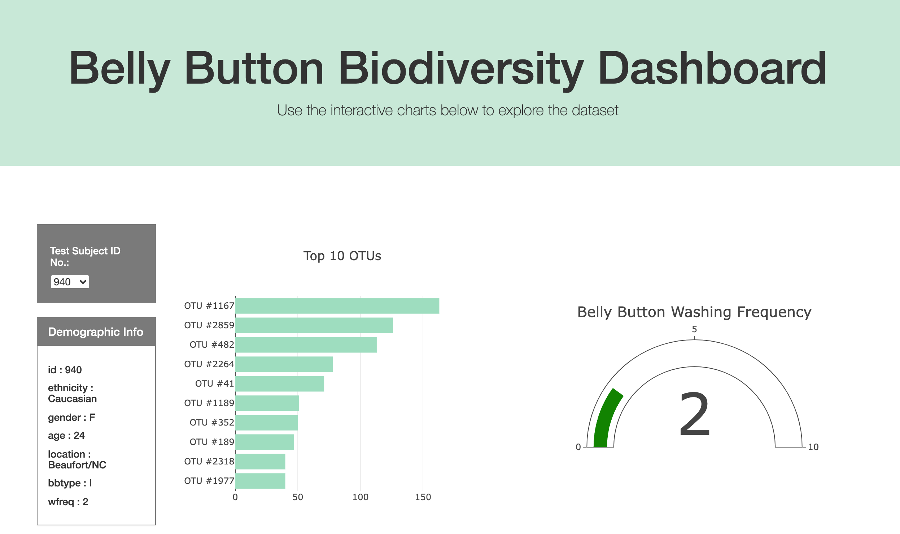
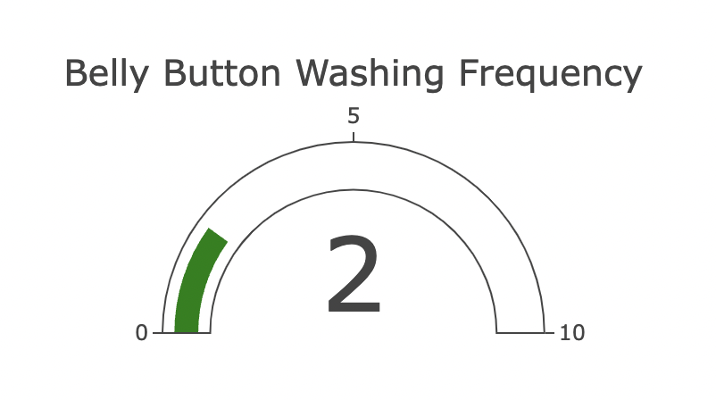

# Plotly Challenge

The website link can be accessed here: [ceci-chapa.github.io/plotly-challenge](https://ceci-chapa.github.io/plotly-challenge/).

For this challenge we are tasked to build an interactive dashboard for a Belly Button Biodiversity study. For the dashboard we will need to include a horizontal bar chart that displays the top 10 OTUs, a bubble chart that displays each sample, and a card that displays the demographic information for each sample. 

### The Dashboard
For the webpage I decided to make some minor style adjustments to better space out the content. From my perspective the main header image appears better as a stand-alone full width div compared to the homework sample. I left the rest of the content such as the charts and graphs within the container so that the attention is drawn more centrally. 

### Gauge Chart

This portion of the dashboard was challenging so I decided to go with the pre-made gauge that was already listed in Plotly. Because of time constraints this worked well to the original sample.   

